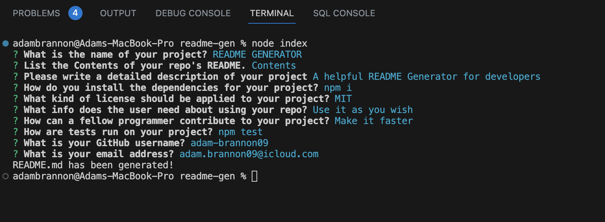

# README.md Generator

Welcome to the README Generator App! This user-friendly Node application is designed to provide developers a quick and easy avenue to generate a simple README.md file for their projects. 

## Installation

To install this application, please follow the below instructions:
- Pull the repository files to your local machine.
- Open the repository in your code editor of choice.
- Open the terminal and run the command `npm i` to install the required dependencies.

## Usage

- Inside the terminal run the command `node index` to start the application.
- Follow the prompts to generate your README.md file.
- Once complete, a README.md file will be generated!

[Check Out the Video Demo!](https://drive.google.com/file/d/1ryuU-_e8MEytOLMoqd7QqLzJ6MlMaoQb/view)

## Contributors
Adam Brannon

[Check me out on GitHub](https://github.com/adam-brannon09)

[Email Me!](mailto:adam.brannon09@icloud.com)

## Feedback and Support

If you encounter any issues while using the README Generator or have any suggestions for improvement, please [open an issue](https://github.com/adam-brannon09/readme_generator/issues) on the GitHub repository. I appreciate your feedback and will address any concerns as soon as possible.

## License

README Generator is released under the [MIT License](https://opensource.org/licenses/MIT). You are free to use, modify, and distribute this application as per the terms of this license.

    

